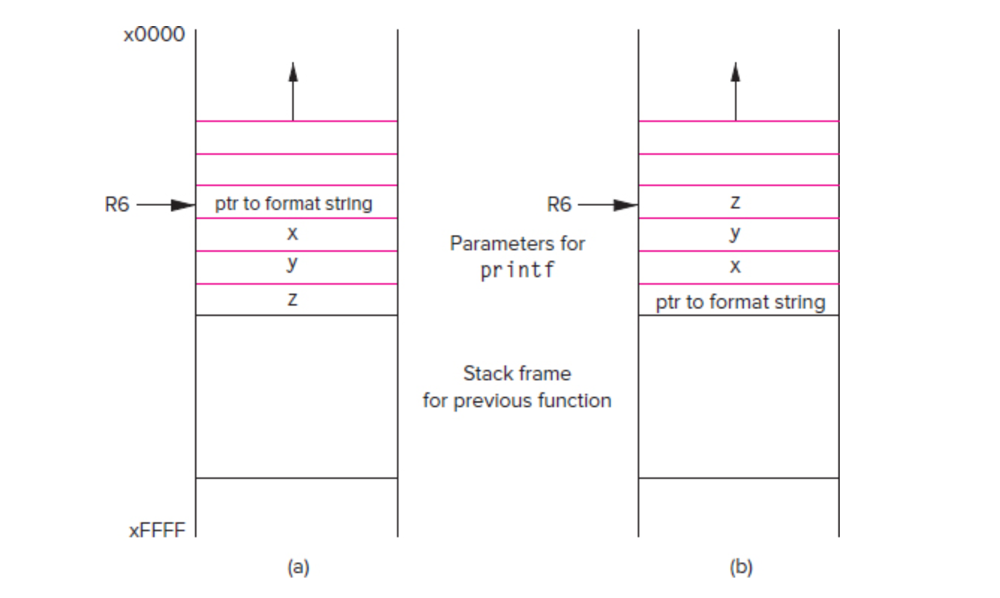

# I/O  In C

This is the note for chapter 18, the I/O in C
## Introduction
C doesn't read or write itself, but instead call the standard library functions that extend the language to perform I/O.

## The C Standard Library
provide i/o, character/string manipulate, mathematical function, file access function, and other system utilities.

The library header file doesn't include the source code. See the "More about C" for detailed description is I can cover that.

Stack Linking: the process of lnking your file and the object file containging the library functions and create an excutatble image.

Libraris can also be linked dynamically, with certain types of libraries(DDLS, dynamically linked libraries.) This reduced the size of file and library, and enable independent development of library and application.

ATTENTION: YOU CAN USE MAN PAGE TO EASILY REFERENCE LIBRARY FUNCTIONS. Type in command ```man 3 function```, like ```man 3 fscanf```, then the manual page for this library function will be provided.

## I/O, One Character At A Time.
the very basic. ```getchar``` and ```putchar```, performing the ASCII I/O in C.(just like IN and OUT in LC3)

#### I/O Streams
The concept **stream** can saparate the consumer from the producer, making it easy to manipulate.(since the consumer and consumer usually operates at different rates)

The computer will get/out from the beginning of a input/output stream, while the now input/out will be added to the end.

In C, the standard input stream is referred to as ```stdin``` and is mapped to keyboard by default, and the standard output stream is referred to as ```stdout``` and is mapped to the display by default.

The function ```getchar``` and ```putchar``` operate on these two stream.

#### getchar and putchar
for these content, ```man 3 getchar``` and ```man 3 putchar``` and try on your computer.

#### Buffered I/O
Run the code below:
```C
#include<stdio.h>
#include<stdlib.h>

void input_peculiar(void) {
    char inChar1;
    char inChar2;

    printf("Input character 1:\n");
    inChar1 = getchar();

    printf("Input character 2:\n");
    inChar2 = getchar();

    printf("The inChar1 is %c\n", inChar1);
    printf("The inChar2 is %c\n", inChar2);
}

int main(void) {
    peculiar();
    return EXIT_SUCCESS;
}
```
Every character typed in by the keyboard will be kept in the ```buffer``` (a small array of queue) until it is released into the ```stream```. In the case of input stream, the buffer is released __until user presses ENTER key__, and the ENTER key itself appears as a ```'\n'``` in the input stream.

The reason why we do this is that press ```ENTER``` can let user confirm input.

<br>
The output stream is similiarly buffered, perform the following code.

```C
#include<stdio.h>
#include<stdlib.h>
#include<unistd>

void output_peculiar(void) {
    putchar('a');

    sleep(5);

    putchar('b');
    putchar('\n');
}

int main(void) {
    output_peculiar(void);
    return EXIT_SUCCESS;
}
```
The character ```a``` will appear only after the ```\n``` release the buffer to the output stream. We say the ```putchar('\n')``` cauese output to be "flushed".

You can also try the following codes to see the different behaviour.
```C
void output_peculiar(void) {
    putchar('a');
    sleep(5);
    putchar('b');
    putchar('\n');
    sleep(5);
    putchar('c');
}
int main(void) {
    output_peculiar(void);
    return EXIT_SUCCESS;
}
```

#### A Little More about Buffer and Stream

__Buffer__ refers to a part of memory location to store the data temprarily. The aim is to increase the efficiency.(Generally, interact with outside is much slower than manipulating inside the memory. So, we do this to diminish the time of interacting.) In C, when using standard I/O functions, it will automatically spare a continuous spece for each stream(like stdin, stdou).

__Stream__ is an abstraction, rather than sth concrete like buffer. We abstract it as a continuous sequence, or stream of character, and that's the reason why we name it stream.

Generally, only when it meets ```'\n'```, the program ends, or the buffer is full, the characters in the buffer will be released into the stream.

```C
void test_without_newline(void) {
    putchar('d');
    putchar('e');
    fflush(stdout);  // mandatorily refresh buffer
    sleep(5);
    putchar('f');
}


int main(void) {
    test_without_newline();
    return EXIT_SUCCESS;
}
```
In this segment of code, we mandatorily release the buffer, so you can see the different result.

## Formatted I/O
remember to ```man 3``` all the function to see its behaviour.

#### printf

```int printf(const char * restrict format, ...);``` is the prototype of printf() defined in the ```<stdio>```.

Generally, ```printf``` writes its first parameter to the standard output stream, a **formatted stream**. Inside the formatted stream, several __conversion specifier__ is embedded. Also, some special characters is also embeded, like ```\n```. (You can try to press ENTER inside the printf function, and it will announce error)

For the conversion specifier, check the textbook for other reference yourself.

The printf begin exames the formatted string a single character a time. If the current character is not a ```%``` or ```\```, then this character will be directly written to the stream. If the current is ```\```, it will interpret the next  as special characters. If it is ```%```, it will convert the value into the specified format characters, and written it to the stream.

ATTENTION, in the printf funtion , there's no relation between the type and specified format. You can choose yourself. The data are just 0s and 1s, you can print it as you like(without raising errors or warnins)

What happens if ```printf("Hi there, %d");```? It will assume that the correct value was written onto the stack, so it blindly read a value off the stack. If it is ```printf("Hi there, %d", 5, 6);```, it will return the first parrameter.

#### scanf
```int scanf(const char *restrict format, ...);``` is the prototype.

It is used to read the formatted input data from the input stream.

The mechanism is similiar to the ```printf``` function, the main difference is that the following arguments should be pointers. It is because ```scanf``` must be able to access the original locations of the objects in memory in order to assign new values to existing variables. 

If the format string also include plain text, scanf will try to match them with input stream.
And Generally, all characters begin with the first no-white context(white space is like space, tab, change line, etc) and ends with a whitespace.

I think the scanf function is quite confusing when you cannot use it properly. The below are a brief description I copy from the manual page.

    Each successive pointer argument must correspond properly with each
     successive conversion specifier (but see the * conversion below).  All
     conversions are introduced by the % (percent sign) character.  The format
     string may also contain other characters.  White space (such as blanks,
     tabs, or newlines) in the format string match any amount of white space,
     including none, in the input.  Everything else matches only itself.
     Scanning stops when an input character does not match such a format
     character.  Scanning also stops when an input conversion cannot be made
     (see below).

If the assign fails, the failed value will reamin the same. However, since the input stream is buffered, the unread characters will remain in the buffer, and the subsequent read begins where the last read fails.

```C
void try_scanf() {
    int a=0, b=0, c=0, d=0;
    scanf("%d/%d", &a, &b);
    scanf("%d %d", &c, &d);
    printf("a = %d, b = %d, c = %d, d = %d\n", a, b, c, d);
}
```
I type in ```2 4 5 6``` and it prints ```a = 2, b = 0, c = 4, d = 5```

By the way, the %lf can receive both decimal and scientific notation, like ```e``` or ```E```.

It is too complex for me to memorize its behavior.
I need to try it. But as I copied form the manual page.

and if you use the specifier ```%c```, it will not discard the whitespace.

#### Variable Argument Lists
the ```printf``` and ```scanf``` funciton have a variable number of arguments, we say these functions has ___variable arguments lists___.

Remember the convention when using run-time stack? Unlike variables declared in the funciton goes from up to down are pushed in the same order, arguments in the function are pushed from right to left. This grarantee the format string is always at the first reference when using these funcitons. And the order of specifiers and the behind variables matches.



## I/O from Files
Remember that the write and read processs are all about stream. So, what we need to do is to connect stream with file.

The general case of ```printf``` and ```scanf``` is ```fprintf``` and ```fscanf```. The main difference is the stream read from/write to.

The ```fclose(FILE * file)``` return ```0``` is successful and ```EOF``` if failure.

the first step in performing the I/O is to declare a ___file pointer___.
The prototype of the corresponding function is ```     FILE *  fopen(const char * restrict path, const char * restrict mode) ```, where mode has "r"(read), "w"(write), etc.

Useful modes: r(reading), w(writing, and it will lost previous content), r+(r + w), a(appending, add contents to the end of the file). SInce both argument are ```string```, so you need to ```"quote them"```.

Here is the code, you can check it by changing the mode.
```C
int main(void) {
    FILE * file = fopen("try_file.txt", "w");
    if(file == NULL) {
        fprintf(stderr, "Cannot open file\n");
        return EXIT_FAILURE;
    }
    fprintf(file, "I also hate RHET!\n");
    return EXIT_SUCCESS;
}
```
Well, sth interesting. r+ will also overwrite everything, and if you use the read-only mode but write, you just fail without receiving errors.

By the way, you can try to write to a .pdf or .png, .jpg, .ppt file and open it to see what happens.

When we meet the end of file, the ```fscanf``` will return a special value ```EOF```, and it is generally ```-1```(because unsigned_char is nonnegative)

This image is a set of common used function. ```man``` them to see their behavior.

By the way, I think ```getline``` is better than ```fgets```